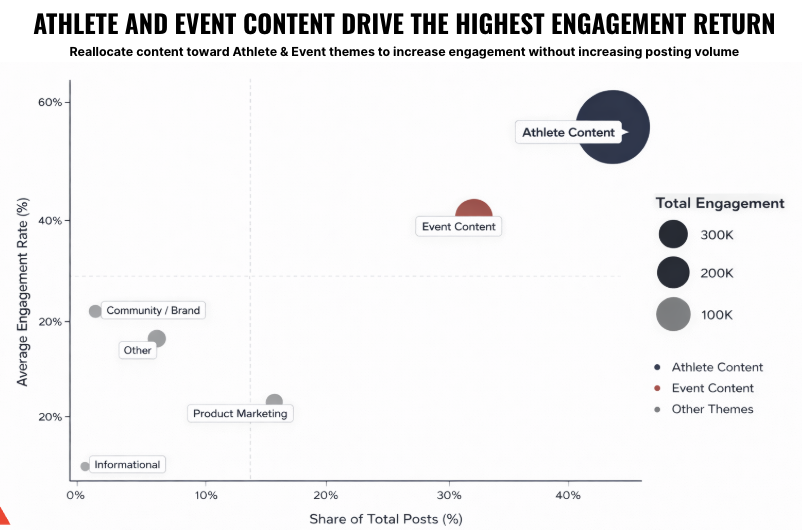
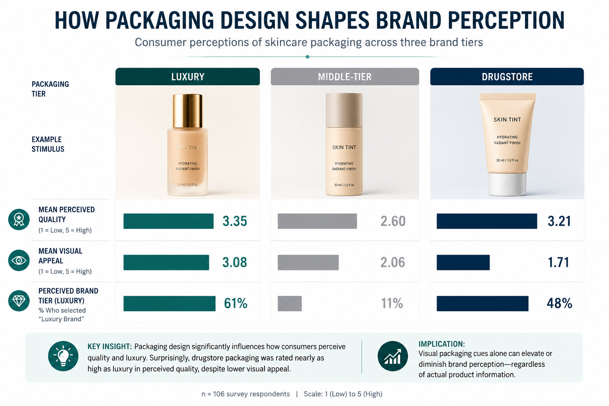
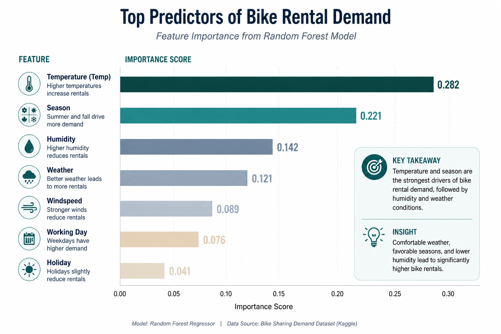
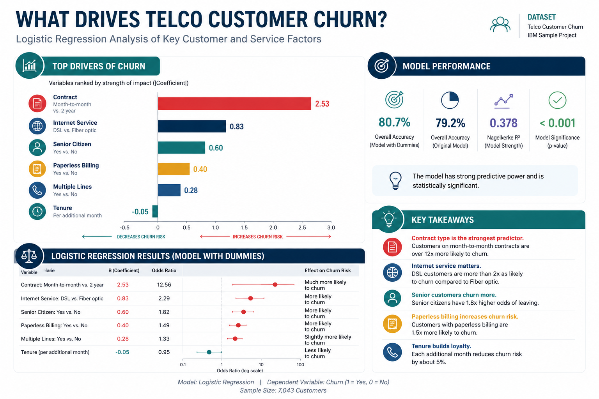

## Digital Marketing & Analytics Projects

### Jeffrey Hsu

MS in Digital Marketing  
Cal Poly Pomona

Marketing Analytics | Digital Strategy | Data Storytelling

---

## Presentation Overview

::: {.incremental}
- Who I am
- Digital marketing projects
- Marketing analytics projects
- Key tools and skills
- Career direction
:::

---

## About Me

I am building a career at the intersection of **digital marketing, analytics, and business strategy**.

My goal is to help organizations understand:

::: {.incremental}
- What marketing efforts are working
- What content drives engagement
- Which channels support conversions
- How data can guide better decisions
:::

---

## Portfolio Structure

::: {.columns}

::: {.column width="50%"}
### Digital Marketing

- SEO strategy
- Social media campaigns
- Email marketing
- Instagram workshop
- Audience engagement
:::

::: {.column width="50%"}
### Marketing Analytics

- Dashboards
- Predictive modeling
- Survey analytics
- Churn analysis
- Website traffic analytics
:::

:::

---

## Digital Marketing Project Highlights

The digital marketing section shows how I approach content, campaigns, SEO, and audience communication from a strategic perspective.

::: {.incremental}
- ODI Grips Instagram dashboard
- TRI off-page SEO strategy
- Instagram marketing workshop
- LAPPL social media campaign
- Digital marketing implementation work
:::

---

## ODI Grips Instagram Dashboard

::: {.columns}

::: {.column width="45%"}
### Project Focus

I analyzed Instagram performance data to understand which posts, captions, and content types created the strongest engagement.

### Skills Used

- Social media analytics
- Quarto dashboarding
- KPI reporting
- Data visualization
:::

::: {.column width="55%"}
{width="95%"}
:::

:::

---

## TRI Off-Page SEO Strategy

### Business Problem

TRI needed stronger organic search visibility and better backlink authority.

### What I Analyzed

::: {.incremental}
- Backlink profile quality
- Competitor SEO performance
- Toxic backlink risks
- Guest posting opportunities
- Partnership outreach strategy
:::

### Business Value

SEO strategy helps increase long-term organic traffic without relying only on paid media.

---

## Instagram Marketing Workshop

### Project Focus

I hosted a workshop on Instagram marketing strategy through the Center for Customer Insights and Digital Marketing.

### Topics Covered

::: {.incremental}
- Instagram strategy
- Audience engagement
- Hashtag usage
- Content planning
- Turning engagement into customers
- Measuring performance with analytics
:::

[Watch Workshop on YouTube](https://www.youtube.com/watch?v=gtleR5ONIog){.btn .btn-primary}

---

## LAPPL Social Media Campaign

### Project Focus

I helped create and publish public safety content for the Los Angeles Police Protective League.

### Digital Marketing Relevance

This project shows how social media can be used for:

::: {.incremental}
- Public awareness
- Message framing
- Timely content publishing
- Audience engagement
- Sensitive issue communication
:::

---

## Marketing Analytics Project Highlights

The marketing analytics section shows how I use data to solve business problems and support marketing decisions.

::: {.incremental}
- ODI Grips content performance matrix
- Skincare packaging perception study
- Bike rental demand prediction
- Telco customer churn analysis
:::

---

## ODI Grips Content Performance Matrix

{width="85%"}

### Key Insight

Athlete and event content created the strongest engagement return, while product-heavy content underperformed relative to posting volume.

---

## Skincare Packaging Perception Study

{width="90%"}

### Key Insight

Packaging design influenced perceived quality, visual appeal, and luxury perception. Drugstore packaging scored surprisingly close to luxury packaging in perceived quality.

---

## Bike Rental Demand Prediction

{width="90%"}

### Key Insight

Temperature, season, humidity, and weather conditions were major drivers of bike rental demand.

---

## Telco Customer Churn Analysis

{width="90%"}

### Key Insight

Contract type, internet service, senior citizen status, and tenure were important predictors of customer churn.

---

## Tools and Platforms

::: {.columns}

::: {.column width="50%"}
### Analytics Tools

- R
- Quarto
- SPSS
- BigQuery
- GA4
- Looker Studio
:::

::: {.column width="50%"}
### Marketing Tools

- HubSpot
- Constant Contact
- WordPress
- Drupal
- Canva
- Adobe Photoshop
:::

:::

---

## What These Projects Show

::: {.incremental}
- I can analyze marketing data
- I can build dashboards and reports
- I can explain insights clearly
- I can connect marketing strategy with business decisions
- I can present technical work to non-technical audiences
:::

---

## Career Direction

I am interested in roles related to:

::: {.incremental}
- Marketing analytics
- Digital strategy
- Performance marketing
- Campaign reporting
- Content performance analysis
- Website traffic analytics
:::

---

## Closing

### Digital Marketing + Analytics

My strongest value is being able to connect **creative marketing execution** with **data-driven decision-making**.

Thank you.

[GitHub](https://github.com/hsujeffrey)  
[LinkedIn](https://www.linkedin.com/)

::: {.notes}
Closing note: Keep this simple. Explain that this portfolio is meant to show both marketing creativity and technical analytics ability.
:::
