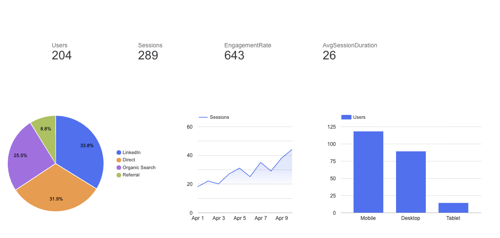

# Website Traffic Analytics

::: {.highlight-box}
This page demonstrates how I would analyze portfolio website performance using a GA4-style dashboard. Since this is a student portfolio website, the traffic numbers are intentionally realistic and low-volume rather than exaggerated.
:::

# Dashboard Overview

::: {.project-card}

<span class="section-tag">GA4-Style Website Analytics</span>

This dashboard summarizes early website traffic for my portfolio site. The goal is to show how I would monitor user behavior, traffic sources, engagement, and device usage in a real marketing analytics workflow.

### Key Metrics

- **204 users**
- **289 sessions**
- **64.3% engagement rate**
- **2.6 minutes average session duration**

:::

# Website Analytics Dashboard

```{=html}
<div class="project-card" style="text-align:center;">
  
</div>
```

# Traffic Source Insights

::: {.project-card}

## Traffic Acquisition

The traffic source chart shows that most users came from **LinkedIn**, **Direct**, and **Organic Search**.

### Interpretation

- **LinkedIn** was the largest traffic source at about **33.8%**
- **Direct traffic** followed closely at about **31.9%**
- **Organic Search** accounted for about **25.5%**
- **Referral traffic** was smaller at about **8.8%**

### Marketing Analytics Relevance

This matters because traffic source analysis helps identify which channels are actually bringing users to the website. For a portfolio site, LinkedIn and direct traffic are especially important because they suggest visitors may be coming from professional networking or resume-related activity.

:::

# Sessions Over Time

::: {.project-card}

## Engagement Trend

The sessions-over-time chart shows a gradual upward trend across the reporting period.

### Interpretation

Sessions increased from the beginning of the period to the end, suggesting that the site was gaining more visibility over time. The growth is not huge, but for a student portfolio website, a steady increase is more realistic and useful than inflated traffic numbers.

### Marketing Analytics Relevance

Trend analysis helps marketers understand whether visibility is improving, declining, or staying flat. Even with low traffic, this type of analysis is useful because it shows whether promotional activity, LinkedIn sharing, or resume views are helping drive more visits.

:::

# Device Breakdown

::: {.project-card}

## User Device Behavior

The device breakdown shows that most users accessed the site through **mobile**, followed by **desktop**, with only a small amount of tablet traffic.

### Interpretation

- **Mobile:** approximately 118 users
- **Desktop:** approximately 89 users
- **Tablet:** approximately 14 users

### Marketing Analytics Relevance

This reinforces the need for a mobile-friendly portfolio. If most visitors are viewing the site on mobile, then page layout, image sizing, navigation, and load speed matter even more.

:::

# Business Takeaways

::: {.columns}

::: {.column width="50%"}

::: {.project-card}

## What Is Working

- LinkedIn is the strongest traffic source
- Direct traffic suggests some brand/name recognition
- Sessions increased over time
- Engagement rate is strong for a portfolio site
- Mobile traffic confirms the importance of responsive design

:::

:::

::: {.column width="50%"}

::: {.project-card}

## What Can Improve

- Referral traffic is still low
- Organic search can grow with stronger SEO
- Project pages should include better keywords
- More internal links can improve navigation
- Resume and project pages should be optimized for recruiters

:::

:::

:::

# Recommended Next Steps

::: {.project-card}

## Optimization Plan

### 1. Improve SEO Readiness

Add clearer page titles, project descriptions, and keyword-rich headings so search engines can better understand the portfolio content.

### 2. Promote Through LinkedIn

Since LinkedIn appears to be the strongest source, future updates should be shared through LinkedIn posts, resume links, and profile features.

### 3. Improve Mobile Experience

Because mobile is the top device category, every page should be checked on a phone for spacing, readability, image scaling, and navigation.

### 4. Track Key Events

Future analytics could track clicks on project links, resume downloads, GitHub visits, and LinkedIn profile clicks.

### 5. Expand Content Over Time

Adding more project write-ups, screenshots, dashboards, and technical explanations can improve both SEO and recruiter engagement.

:::

# Analytics Reflection

::: {.highlight-box}
The main value of this dashboard is not the amount of traffic. The value is showing that I understand how to measure website performance, interpret user behavior, and turn analytics into practical improvement steps.
:::
